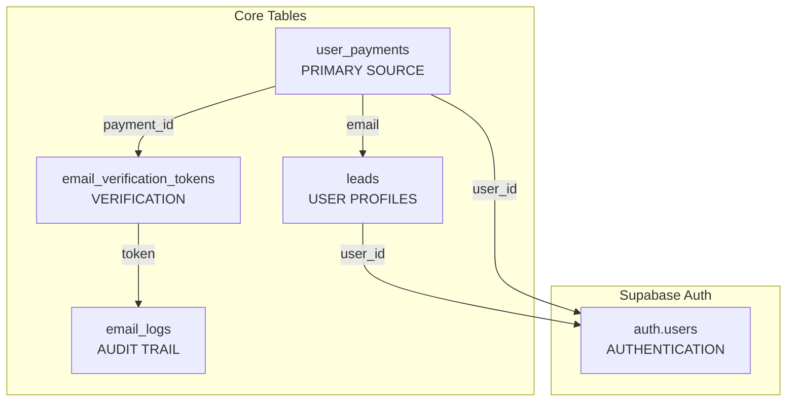

# 🗄️ Complete Database Schema for Payment-Gated Auth Flow

## 📊 **Schema Overview**

This database schema supports the **Payment-First → Email Verification → Signup → Dashboard** flow, following the memory pattern for async user flows where payments occur before user account creation.

## 🏗️ **Core Tables Structure**



## 📋 **Table Details**

### 1. **user_payments** (Payment Tracking)
```sql
Key Fields:
├── payment_id (UNIQUE) - PayPal transaction ID
├── email - User provided email
├── payer_email - PayPal payer email
├── user_id - NULL initially (async flow)
├── payment_status - 'pending', 'completed', 'failed'
├── email_verified - Boolean verification status
└── transaction_details - Full PayPal response (JSONB)
```

**Critical Design**: `user_id` is **nullable** because payments happen before user accounts exist.

### 2. **leads** (User Profiles)
```sql
Key Fields:
├── email (UNIQUE) - Primary identifier
├── full_name, phone, country_code - User info
├── payment_reference_id - Links to user_payments.payment_id
├── is_email_verified - Email verification status
├── user_id - Links to auth.users (nullable)
└── payment_status - 'pending', 'completed'
```

### 3. **email_verification_tokens** (Verification)
```sql
Key Fields:
├── payment_id - Links to user_payments
├── token (UNIQUE) - Verification token
├── is_used - Prevents token reuse
├── expires_at - 24-hour expiration
└── email - Recipient email
```

### 4. **email_logs** (Audit Trail)
```sql
Key Fields:
├── recipient - Email address
├── email_type - 'verification', 'failure', 'welcome'
├── status - 'sent', 'failed', 'pending'
├── payment_id - Links to payment
└── sent_at - Delivery timestamp
```

## 🔄 **Flow Integration**

### **Payment Flow:**
1. PayPal payment creates record in `user_payments` (user_id = NULL)
2. Email verification token stored in `email_verification_tokens`
3. Email delivery logged in `email_logs`

### **Signup Flow:**
1. User clicks verification link
2. Token validated via `verify_email_token()`
3. User profile created in `leads`
4. Supabase auth user created
5. `user_id` linked in both tables

### **Login Flow:**
1. `can_user_login()` checks payment verification
2. RLS policies ensure data access security
3. Dashboard access granted only to verified users

## 🛡️ **Security Features**

### **Row Level Security (RLS):**
```sql
-- Users can only access their own data
WHERE auth.jwt() ->> 'email' = email 
   OR auth.jwt() ->> 'email' = payer_email
   OR user_id = auth.uid()
```

### **Email Matching Enforcement:**
```sql
-- Prevents fraud by ensuring email consistency
IF LOWER(TRIM(paypal_email)) != LOWER(TRIM(signup_email)) THEN
    RETURN QUERY SELECT FALSE, 'Email mismatch'::TEXT;
END IF;
```

### **Function Security:**
- All functions use `SECURITY DEFINER`
- Strict parameter validation
- Comprehensive error handling

## 📈 **Performance Optimizations**

### **Strategic Indexes:**
```sql
-- Email-based lookups (most common)
idx_user_payments_email_lower
idx_leads_email_lower

-- Payment ID lookups
idx_user_payments_payment_id
idx_leads_payment_ref

-- Verification operations
idx_email_verification_tokens_token
idx_email_verification_tokens_expires_at
```

## 🔧 **Key Functions**

### **`get_verified_payment_status(email)`**
Returns comprehensive payment verification status for any email.

### **`secure_signup_with_payment_verification()`**
Enforces email matching and creates verified user profile.

### **`can_user_login(email)`**
Determines if user has valid payment and verification.

### **`verify_email_token(token)`**
Validates and processes email verification tokens.

## 🎯 **Design Principles**

### **1. Async-First Design**
- Payments can exist without users
- Foreign keys allow NULL values
- Email-based RLS instead of user_id dependencies

### **2. Single Source of Truth**
- `user_payments` is authoritative for payment data
- `leads` focuses on user profile information
- Clear separation of concerns

### **3. Security by Default**
- Email matching enforced at database level
- RLS policies prevent data leakage
- Comprehensive audit logging

### **4. Maintainability**
- Clear naming conventions
- Comprehensive indexing
- Cleanup functions for token expiration

## 🚀 **Usage Instructions**

### **1. Deploy Schema:**
```bash
# Run in Supabase SQL Editor
psql -f COMPLETE-DATABASE-SCHEMA.sql
```

### **2. Verify Deployment:**
```sql
-- Check tables exist
SELECT table_name FROM information_schema.tables 
WHERE table_schema = 'public';

-- Check functions exist
SELECT proname FROM pg_proc WHERE pronamespace = 
(SELECT oid FROM pg_namespace WHERE nspname = 'public');
```

### **3. Test Payment Flow:**
```sql
-- Test payment verification
SELECT * FROM get_verified_payment_status('user@example.com');

-- Test login authorization
SELECT * FROM can_user_login('user@example.com');
```

## 🔍 **Monitoring & Maintenance**

### **Regular Cleanup:**
```sql
-- Run weekly to clean expired tokens
SELECT cleanup_expired_tokens();
```

### **Health Checks:**
```sql
-- Monitor payment completion rates
SELECT payment_status, COUNT(*) 
FROM user_payments 
GROUP BY payment_status;

-- Check email verification rates
SELECT email_verified, COUNT(*) 
FROM user_payments 
WHERE payment_status = 'completed'
GROUP BY email_verified;
```

This schema provides a robust foundation for your payment-gated authentication system while maintaining security, performance, and maintainability! 🎉